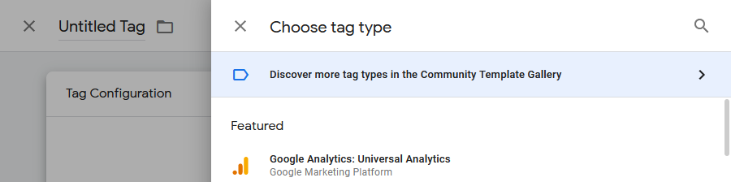
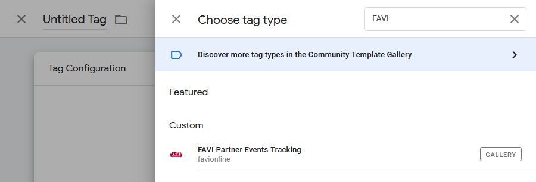

# FAVI Partner Events Tracking

## Implementation guide - Google Tag Manager

### Integration types

There are three main ways how to integrate *FAVI Partner Events Tracking* into your e-shop:

1. [direct client-side (frontend) integration of FAVI script (called C2S)](https://github.com/favionline/partner-events-tracking/blob/master/doc/implementation-guide/client-direct.md),
2. client-side (frontend) integration using Google Tag Manager (called GTM),
3. [server-to-server integration using API (called S2S)](https://github.com/favionline/partner-events-tracking/blob/master/doc/implementation-guide/server-to-server.md).

The S2S solution is most feature rich, reliable and secure, but requires direct integration into your backend code, which is not feasible for everyone. So pick the integration which most suits your situation.

This guide is for the GTM integration, but you can have a look at the other ones using appropriate links.

### Adding *FAVI Partner Events Tracking* into your GTM

We have prepared a GTM tag template, which is published in the GTM *Community Template Gallery*, so it is ready to be used - you will just provide the needed data.

Use the template by following these steps:

1. add new tag to your GTM container and select `Discover more tag types in the Community Template Gallery`,



2. find the `FAVI Partner Events Tracking` template and select it,


3. add the template to your workspace,


4. configure the tag based on the event type (see below).


You will need to go through steps 1-3. only the first time, then you can find the tag template in the `Custom` section.



### `createOrder` event


In `createOrder Event Data` field, you need to provide a GTM variable with order data. In GTM there are multiple ways how to pass this data, typically it can be based on a *Data Layer Variable*, a *Custom JavaScript* variable or any other option. You might even already have an order variable ready used for a different service.

**In any case please make sure the format of the object returned by the selected variable matches the format described below.**

If you are doing something wrong, you should see error messages in web console / developer tools (usually F12 in browser). When you are all set up, you should see network requests being sent to `https://partner-events.favi.{XX}`, where `{XX}` is the country where your e-shop is registered.

`order` is an object with the following format:

* `orderId`
  * required, string
  * your internal order ID
* `orderItems`
  * required, array of `orderItem` objects (see below)
* `customer`
  * required, `customer` object (see below)
* `expectedDeliveryDate`
  * optional, string
  * format conforming to `Y-m-d` according to [PHP date format](https://www.php.net/manual/en/datetime.format.php#refsect1-datetime.format-parameters)
  * will be used to decide when to send review request to customer

`orderItem`:

* `id`
  * required, string
  * your product ID, must match the ID you are using in XML feed provided to FAVI
* `name`
  * required, string
  * your product name, must match the name you are using in XML feed provided to FAVI

`customer`:

* `email`
  * required, string
  * will be used to send review request to customer
* `name`
  * optional, string
  * will be used to show name in the review, customer will have to confirm sharing it publicly, but this eases the review filling process

If you have this data already in GTM, but the format does not match, you can always create for example a new GTM *Custom JavaScript* variable and map the data to the required format. You can even compose multiple existing variables this way.

For example if you were using a flatter structure for the order object, you can convert it to the required format by this *Custom JavaScript* variable:

```js
function() {
	var order = {{Order}};

	return {
		orderId: order.id,
		orderItems: order.items.map(function (item) {
			return {
				product: {
					id: item.id,
					name: item.name,
				},
			};
		}),
		customer: {
			email: order.email,
			name: order.name,
		},
		expectedDeliveryDate: order.expectedDeliveryDate,
	};
}
```

### Content Security Policy (CSP)

If your e-shop is using CSP, you will have to allow *FAVI Partner Events Tracking* to do its job by allowing sending tracking data to `https://partner-events.favi.{XX}` (`connect-src`), where `{XX}` is the country where your e-shop is registered.

Also, if you are not using the recommended setup of GTM with CSP using nonce - https://developers.google.com/tag-manager/web/csp - you might need to also allow loading tracking script from `https://partner-events.favicdn.net` (`script-src`).

If you did not use *Custom JavaScript* variables before and are using now, read https://developers.google.com/tag-manager/web/csp#custom_javascript_variables .

### Contact

If you have any questions regarding the implementation or need any help, please ask our account managers (you can find your contact in your partner dashboard after logging in on FAVI).
